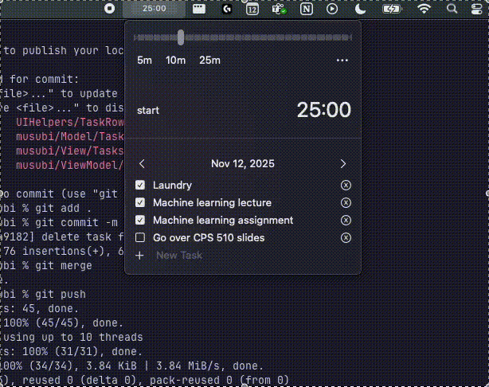

# musubi

A minimal macOS menu bar timer with task tracking.



## Features

- **Timer**: Set duration from 0-120 minutes with a ruler slider
- **Presets**: Quick access to customizable timer presets
- **Floating window**: Optional always-on-top timer display
- **Task tracker**: Simple checklist to track what you're working on
- **Customizable**: Accent colors and sound notifications
- **Menu bar native**: Lives in your menu bar, out of the way

## Requirements

- macOS 13.0 (Ventura) or later
- Xcode 16+ (for building from source)

## Installation

### Homebrew (Recommended)

```bash
brew install --cask musubi
```

### Download

Download the latest `.app` from [Releases](https://github.com/Kiizon/musubi/releases).

### Build from Source

```bash
git clone https://github.com/Kiizon/musubi.git
cd musubi
xcodebuild -scheme musubi -configuration Release -derivedDataPath build
```

The built app will be at `build/Build/Products/Release/musubi.app`.

Or open `musubi.xcodeproj` in Xcode and build with ⌘B.

## Usage

1. Click the menu bar icon to open the timer
2. Drag the slider or click a preset to set duration
3. Press Start to begin the countdown
4. Optionally enable the floating timer window in Settings
5. Use the Tasks tab to track your to-dos

## Contributing

Contributions are welcome! Please read [CONTRIBUTING.md](CONTRIBUTING.md) for guidelines.

## License

[MIT](LICENSE) - Kish Dizon

---

*musubi (結び) - another rice ball, because why not*
